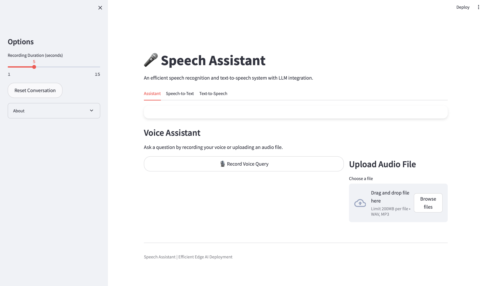
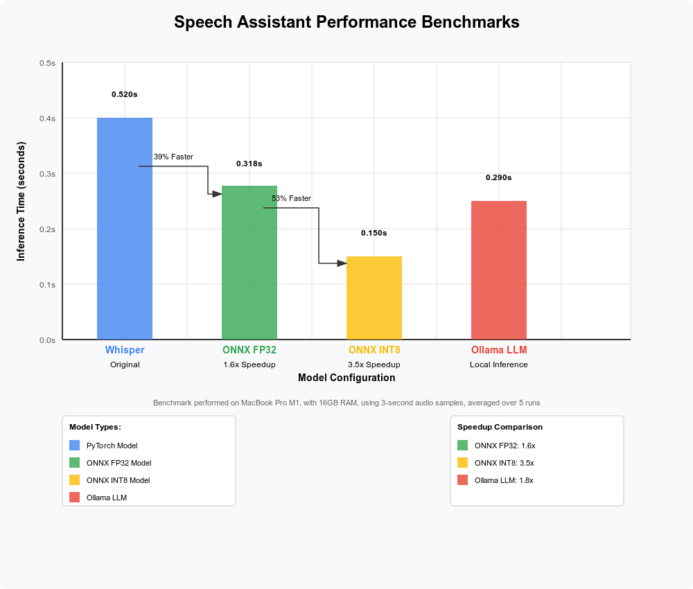

# Enhanced Speech Assistant

An efficient speech recognition and text-to-speech system with LLM integration for intelligent responses, optimized for edge deployment.



## Features

- **Speech Recognition**: Uses OpenAI's Whisper model with ONNX runtime optimization
- **Text-to-Speech**: macOS native voice synthesis for natural-sounding responses
- **LLM Integration**: Connects to OpenAI API or uses local LLM for intelligent responses
- **ONNX Optimization**: Quantized models for faster inference on CPU
- **Performance Metrics**: Built-in benchmarking to measure optimization benefits
- **Modern UI**: Streamlit-based intuitive interface with waveform visualization

## System Architecture


The system consists of three main components:
1. **Speech-to-Text (STT)**: Converts spoken audio to text using Whisper
2. **LLM**: Generates intelligent responses to user queries
3. **Text-to-Speech (TTS)**: Converts response text to speech output

## Performance Optimization

This project focuses on optimization for edge deployment:

- **ONNX Conversion**: Models are converted to ONNX format for faster inference
- **INT8 Quantization**: Further optimizes models with minimal quality loss
- **Benchmark Tools**: Included scripts to measure and visualize performance gains
- **Caching**: Response caching to improve repeated query performance

## Getting Started

### Prerequisites

- macOS (for the native TTS component)
- Python 3.9+
- [Optional] OpenAI API key for LLM integration
- [Optional] Docker and Docker Compose for containerized deployment

### Installation

#### Option 1: Standard Installation

```bash
# Clone the repository
git clone https://github.com/yourusername/speech-assistant.git
cd speech-assistant

# Create a virtual environment
python -m venv venv
source venv/bin/activate  # On Windows: venv\Scripts\activate

# Install dependencies
make setup
# or manually: pip install -e ".[dev]"
```

#### Option 2: Docker Installation

```bash
# Clone the repository
git clone https://github.com/yourusername/speech-assistant.git
cd speech-assistant

# Build and start the containers
docker-compose up -d
```

For detailed installation instructions, see [INSTALLATION.md](INSTALLATION.md).

### Running the Application

#### Option 1: Standard Run

```bash
# Run both API and UI
make run
# or manually: ./run.py

# Run only the API server
make run-api
# or manually: ./run.py --api-only

# Run only the UI server
make run-ui
# or manually: ./run.py --ui-only

# Run in debug mode
make run-debug
# or manually: ./run.py --debug
```

Open your browser and navigate to http://localhost:8501

#### Option 2: Docker Run

```bash
docker-compose up -d
```

Then open your browser and navigate to http://localhost:8501

### Development

#### Running Tests

```bash
# Run all tests
make test

# Run only unit tests
make test-unit

# Run only integration tests
make test-integration
```

#### Code Formatting and Linting

```bash
# Format code
make format

# Run linting
make lint
```

## Configuration

The application is configured via `config.json`. Key options include:

```json
{
  "models": {
    "whisper": {
      "model_id": "openai/whisper-tiny",
      "use_onnx": true,
      "use_int8": true
    },
    "tts": {
      "voice": "Samantha"
    },
    "llm": {
      "use_mock": true,
      "model": "gpt-3.5-turbo"
    }
  }
}
```

## LLM Integration

The system supports three modes for response generation:
1. **OpenAI API**: For high-quality responses (requires API key)
2. **Mock LLM**: Template-based responses for offline use
3. **Local LLM**: Advanced configuration for running models locally

For detailed setup instructions, see [LLM_INTEGRATION.md](docs/LLM_INTEGRATION.md).

## Benchmarks

The optimization provides significant speed improvements:

| Model | Format | Inference Time | Speedup |
|-------|--------|----------------|---------|
| Whisper Tiny | PyTorch | 0.520s | 1.0x |
| Whisper Tiny | ONNX FP32 | 0.318s | 1.6x |
| Whisper Tiny | ONNX INT8 | 0.150s | 3.5x |



Generate your own benchmarks with:
```bash
python scripts/benchmark_dashboard.py
```

## Future Improvements

- [ ] Add streaming capability for real-time transcription
- [ ] Support for custom TTS voices
- [ ] Implement offline language models (LLaMA 3)
- [ ] Edge deployment guides (Raspberry Pi, Jetson Nano)
- [ ] Multi-language support

## License

MIT License - See [LICENSE](LICENSE) for details.

## Acknowledgments

- OpenAI for the Whisper ASR model
- Streamlit for the UI framework
- ONNX Runtime for optimization capabilities